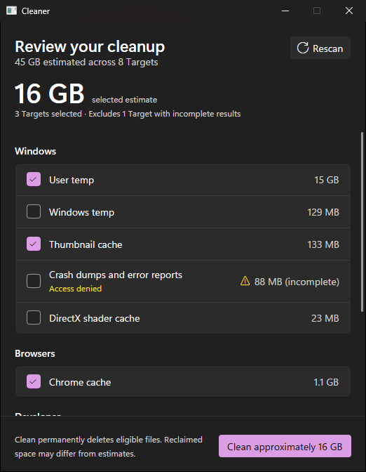
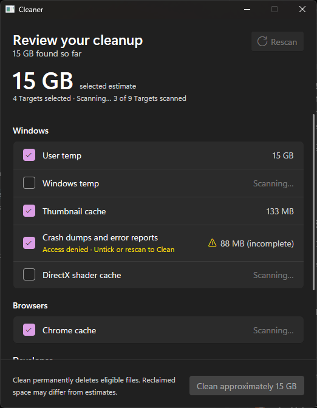

# cc-cleaner-at-home

A small, offline Windows 11 app for reviewing and permanently deleting caches and discarded files. It is a personal replacement for CCleaner: one screen, a fixed list of cleanup Targets, honest size estimates, and no network access.

  

## How it works

1. **Scan.** On launch the app Scans every Target and fills in each row as it finishes, starting with the ticked ones. The header shows the estimated size of the Selection.
2. **Review.** Tick or untick Targets. The app saves each change right away. Developer caches and the DirectX shader cache start unticked because rebuilding them costs time or downloads.
3. **Clean.** Click **Clean approximately …**. The checklist is the confirmation. Deletion is permanent, and the app reports what it deleted, what it skipped, and why. It then Scans again.

  

Rows update while the Scan runs. A Target that could not be fully inspected shows the reason, such as *Access denied*, and blocks Clean until you untick it or rescan. Clean stays available while unticked Targets are still scanning.

See [`CONTEXT.md`](CONTEXT.md) for the domain terms (Target, Minimum age, Selection, Scan, Clean) and [`.scratch/cleaner-v1/`](.scratch/cleaner-v1/) for the full spec and issues.

## Targets

| Category | Target | What gets deleted | Minimum age | Ticked by default |
|---|---|---|---|---|
| Windows | User temp | `%LOCALAPPDATA%\Temp` | 24 hours | Yes |
| Windows | Windows temp | `%WINDIR%\Temp` | 24 hours | Yes |
| Windows | Recycle Bin | Your Recycle Bin on each local fixed drive, emptied through Windows | – | Yes |
| Windows | Thumbnail cache | `thumbcache_*.db` in `%LOCALAPPDATA%\Microsoft\Windows\Explorer` | – | Yes |
| Windows | Crash dumps and error reports | `%LOCALAPPDATA%\CrashDumps`, per-user and machine WER report folders | – | Yes |
| Windows | DirectX shader cache | `%LOCALAPPDATA%\D3DSCache` | – | No |
| Browsers | Chrome cache | `Cache`, `Code Cache`, and `GPUCache` in each Chrome profile | – | Yes |
| Developer | pnpm store | `%LOCALAPPDATA%\pnpm\store` | – | No |
| Developer | pip cache | `%LOCALAPPDATA%\pip\cache` | – | No |
| Developer | Go build cache | `%LOCALAPPDATA%\go-build` | – | No |

The table is fixed in [`src/targets.rs`](src/targets.rs). Neither the saved Selection nor the UI can add paths.

## Safety

- **Only listed contents.** The app deletes eligible contents of each Target folder and keeps the folder itself. It never touches cookies, history, saved sessions, passwords, or form data.
- **No link following.** It never follows symlinks, junctions, or other reparse points. It works through directory handles, so a folder renamed or swapped during a Clean cannot redirect deletion elsewhere.
- **Minimum age.** The temp Targets keep files modified within the 24 hours before the operation starts, and Clean rechecks the age. This lowers the risk of deleting working files but does not prove a file is unused.
- **Recycle Bin through Windows.** The app queries and empties the Recycle Bin only through the Windows shell, never by opening `$Recycle.Bin`. Clean empties only the drives the latest Scan covered. Windows reports no per-file results, so the result says the bin was emptied without a deleted size.
- **No forcing.** It never takes ownership, changes permissions, closes apps, or schedules deletion on reboot. Rejected deletions are skipped and reported by reason.
- **Offline.** The app makes no network calls and has no telemetry or updater.
- **Estimates stay estimates.** Hard links, compression, and running apps can make reclaimed disk space differ from the deleted file sizes.

### Validation status

Clean is enabled. The core and controller pass disposable-folder checks, but the packaged app has not passed a destructive end-to-end test in an isolated Windows installation or concurrent owner-behavior validation. Kevin explicitly waived those checks for the temp Targets on 2026-09-27. [Issue 03](.scratch/cleaner-v1/issues/03-add-folder-based-targets.md) records the evidence for each other Target, including the Windows Targets that have only Disk Cleanup references and no owner-behavior check. Kevin confirmed on 2026-09-30 that emptying a real Recycle Bin works; [Issue 04](.scratch/cleaner-v1/issues/04-add-recycle-bin-cleanup.md) lists the Recycle Bin cases that were tested only against a fake shell.

## Install

There is no installer. Build `cc-cleaner.exe` (below), copy it anywhere, and run it. It needs no VC++ redistributable or other runtime. Release builds ask for administrator rights once at launch so they can reach `%WINDIR%\Temp` and the machine-wide error reports.

The Selection is stored in `%APPDATA%\cc-cleaner-at-home\selection.json`. If that file is malformed or unreadable, the app starts with every Target unticked and shows the error. Nothing else is persisted.

## Build and run

Requires Windows 11 x64 and the Rust toolchain pinned in [`rust-toolchain.toml`](rust-toolchain.toml).

- `cargo run` starts a debug build as the current user. It scans the real Target folders. Debug builds do not ask for elevation, so Windows temp and crash reports can report access errors unless the terminal runs as administrator.
- `cargo build --release` builds `target\release\cc-cleaner.exe`, the single file that ships. It requires elevation, so start it with `Start-Process` or from File Explorer. `cargo run --release` fails with OS error 740 unless the terminal runs as administrator.
- Release builds compile GPUI's shaders with `fxc.exe` from the Windows SDK. Set `GPUI_FXC_PATH` if GPUI cannot find it.
- `cargo test --lib` runs the core, Target table, Selection store, controller, checklist grouping, and formatting checks. CI also runs `cargo fmt --check` and `cargo clippy --all-targets -- -D warnings`.

## Platform notes

- The UI is built with [GPUI](https://gpui.rs/), pinned to one Zed revision in `Cargo.toml`. It renders with Direct3D 11 at feature level 10.1 or higher. The Microsoft Basic Render Driver qualifies when there is no GPU.
- The window follows the Windows light, dark, and high-contrast themes and the Windows text size, including changes while it is open.
- The C runtime is linked statically, so the executable needs no VC++ redistributable.
- `build.rs` embeds `resources/app.manifest`. GPUI's own manifest feature is off, because it cannot require elevation.

## Checks after a GPUI or toolchain update

Run both scripts from an elevated PowerShell session, because the app runs elevated.

- `scripts/dump-uia.ps1` prints the window's UI Automation tree: control names, roles, and checked and disabled states. Use `-Toggle <name>` or `-Invoke <name>` to act on a control first.
- `scripts/trace-network.ps1 -Exe <path> -Dir <output folder>` traces launch, the displayed User temp and Windows temp checkbox changes (restoring the original Selection), manual Rescan, and close. The app must own 0 network events, and a successful curl positive control must own network events. The report excludes Clean, the Scan-to-Clean handoff, and the automatic post-Clean rescan, because the script exercises only non-destructive controls.

`scripts/owner-checks` holds the owner-behavior checks used to admit or exclude Targets. They damage scratch caches and a scratch browser profile, never the real ones, and need network access.
